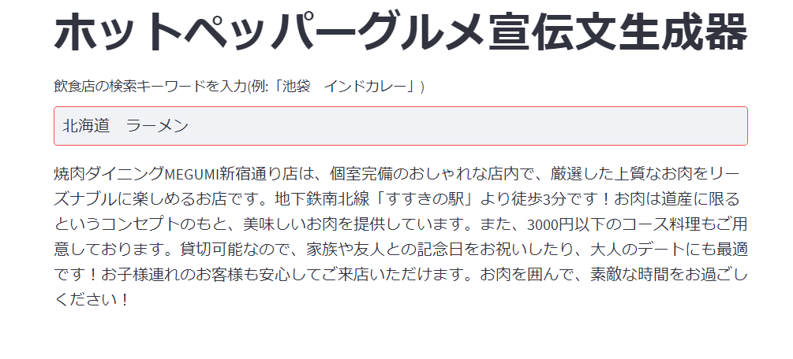

<<<<<<< HEAD
# chatGPT_hotpepper

の画像みたいに検索キーワードからchatGPTで生成するアプリ



# 操作手順([参考](https://docs.streamlit.io/knowledge-base/tutorials/deploy/docker))
まず、このレポジトリを適当なディレクトリにクローンしてください
```bash
git clone https://github.com/RyozoMasukawa/chatGPT_hotpepper.git
```

## APIキーについて
まず、[streamlit_share.py](./streamlit_share.py)の冒頭のAPIキーを自分のものにしてください

## Dockerfileについて
[Dockerfile](./Dockerfile)のポート番号のところは空いてるものに変更してください

## ビルドとデプロイ

1. ビルド
```bash
docker build -t [好きな名前] . 
```
2. デプロイ
```bash
docker run -p [決めたポート番号]:[決めたポート番号] streamlit
```
=======
# Streamlit_Web_App
>>>>>>> origin/main
